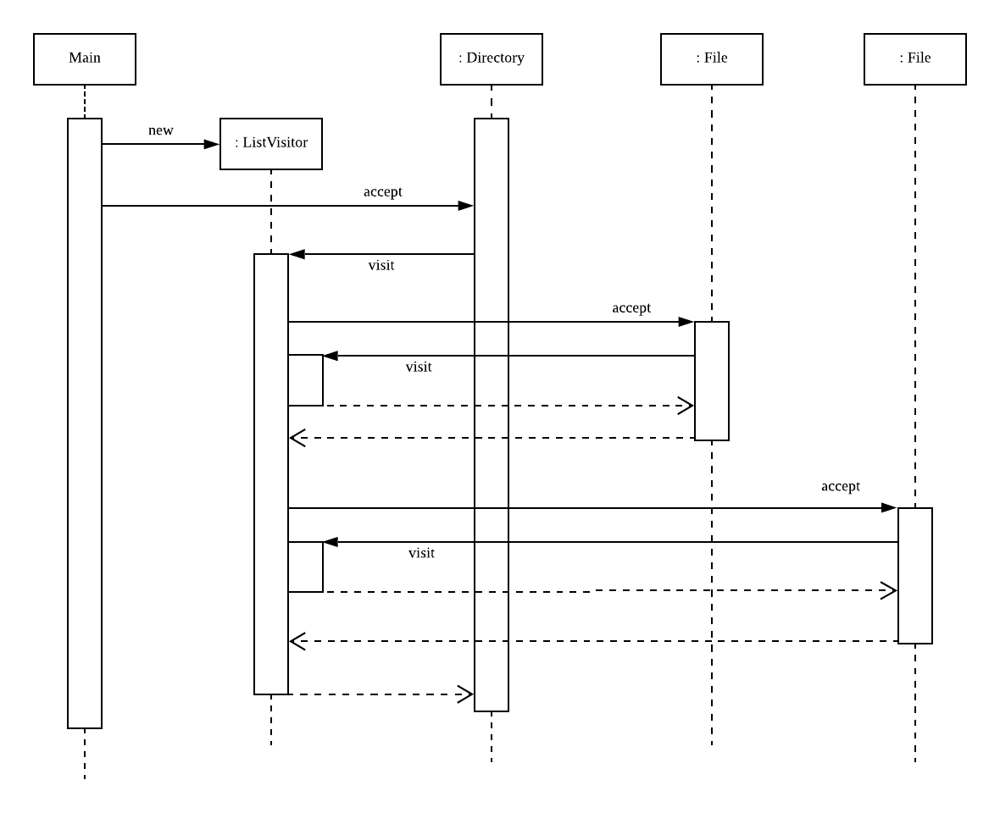

# Visitor pattern

## visitor패턴이란?
데이터 구조와 처리를 분리하는 패턴. 데이터 구조를 돌아다니는 주체인 '방문자'를 만들어서 그 클래스에 처리를 위임함. 새로운 처리를 추가하고 싶으면 데이터 구조를 수정하는게 아닌 새로운 방문자를 만들면됨  

## 예제 코드의 다이어그램
예제코드에서 visitor는 element의 accept(this)를 호출하고 그 안에서 element는 visitor의 visit(this)를 호출함. 이렇게 서로가 서로를 호출하는 형태라 이해하기 쉽지않음. 아래 시퀀스 다이어그램을 통해 실행 흐름을 이해해보자  

  

다이어그램을 보면 각 element당 accept는 한번만 호출되고 visit은 element에서 accept을 실행한뒤 다시 visitor로 돌아가기위해 사용되는걸 알수있음.  

이렇게 서로가 정반대의 관계에서 서로를 호출하는 구조를 **더블 디스패치(double dispatch)**라고 함

## visitor패턴의 구성
- Visitor: 데이터 구조의 각 요소(ConcreteElement)마다 방문했다는걸 표시하는 visit(xxx)메소드를 선언
- ConcreteVisitor: Visitor역할의 인터페이스를 구현한 클래스. visit메소드를 구현하고 각 ConcreteElement 역할의 처리를 기술. ListVisitor가 이 역할. 
- Element: visitor역할의 방문하라 곳을 나타내는 역할. accept메소드가 선언됨. accept메소드의 파라미터에는 visitor역할이 전달됨.
- ConcreteElement: element역할의 인터페이스를 구현한 클래스. File, Directory클래스가 해당
- ObjectStructure: element역할의 집합을 취급하는 역할. directory클래스가 해당됨. directory에서 iterator메소드를 구현하여 visitor가 entry집합을 각각 방문할수있도록 해준것처럼 concretevisitor가 각각의 element들을 취급할수있는 메소드를 가지고있음  

## visitor패턴 왜 사용함?
그냥 데이터구조안에 새로 메소드만들어서 반복문으로 처리하면 훨씬 단순해질텐데 왜 굳이 visitor패턴을 적용해서 복잡하게 처리해야함?  

-> visitor패턴의 목적이 **처리를 데이터구조에서 분리**하는 것이기 때문임. 데이터구조는 각 요소를 집합으로 정리하거나 요소사이를 연결해주는 역할을 수행하지만 해당 구조를 기반으로 무언가를 처리하는 동작은 데이터구조가 할일이 아님. 데이터구조안에 메소드 만들어서 반복문으로 처리하는 방식으로 하면, 새로운 처리를 추가해서 기능을 확장할때마다 그 구조와 관련된 클래스들을 모두 수정해야함. 따라서 visitor패턴은 부품으로써의 독립성을 높일수 있음.

## visitor패턴의 특징
1. concretevisitor를 추가하는건 간단하지만, ConcreteElement가 새로 추가될경우 모든 ConcreteVisitor에 해당 element에 대한 visit메소드를 새로 구현해야함  
2. visitor패턴이 데이터구조를 돌아다니면서 각 element에 대한 처리를 하기위해서 element에서 이에대한 충분한 정보를 제공해야함. 예제코드의 iterator()가 이러한 역할. visitor가 directory에 대한 처리를 하려면 accept메소드 뿐만아니라 directory안의 element에 접근할수 있는 iterator메소드가 필요.

## 객체지향의 The open-closed principle
객체지향에는 The open-closed principle이라는 원칙이 있음. 이 원칙은  

> 클래스는 확장에는 열려있지만, 수정에대해서는 닫혀있어야 한다  

클래스를 설계할때 기능을 추가하고 확장하는거에 대해선 확장을 허용해야함. 하지만 확장할때마다 기존의 클래스를 수정해선 안됨. 이러한 원칙을 지키는 클래스가 부품으로써 재이용가치가 높은 클래스임. 우리가 배우는 디자인패턴이 바로 이런 클래스를 만들수있는 구조를 제공하는거임

